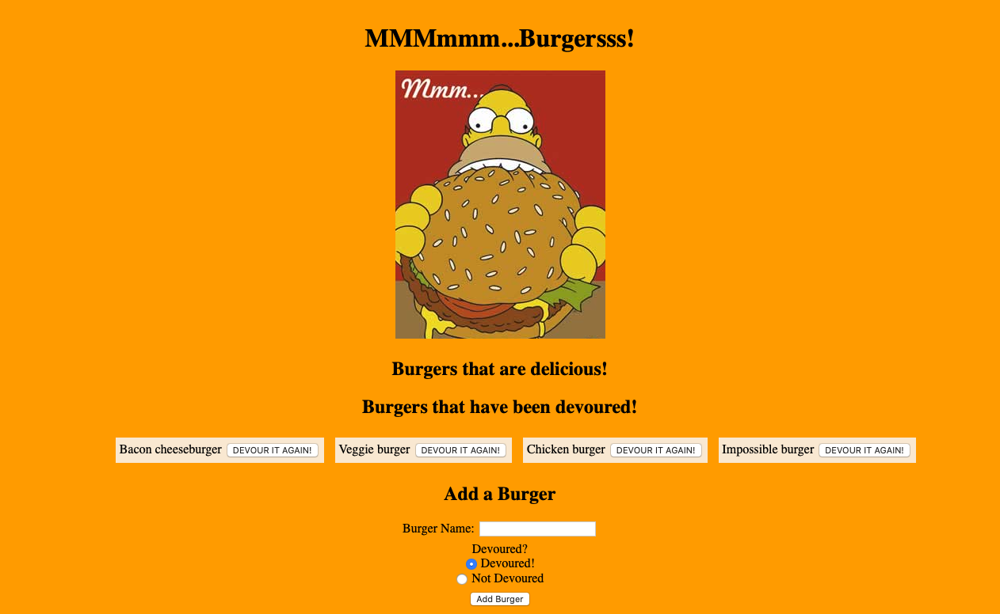

# burger

## Overview:

Mmmmmmmmmmm....Buurrggggerrrrrssssss!!!! --Homer Simpson voice--

For this assignment, the reader will find a hamburger logger application that utilizes previously learned concepts including MySQL, Node and Express. Handlebars and a homemade ORM are new concepts that were implemented as well. Handlebars is used to generate the app's HTML, while Node and MySQL is used to query and route data to the burger app.

Please find additional information regarding this project below. Thanks so much!

## Screenshot of Generated Application

## Credits/Resources

1. Node.js: https://nodejs.dev/learn/the-nodejs-fs-module

2. NPM - Inquirer: https://www.npmjs.com/package/inquirer#prompt

3. MySQL: https://www.mysqltutorial.org/mysql-self-join/

4. Youtube: https://youtu.be/msvdn95x9OM

5. MYSQL Heroku Deployment Guide: (../../04-Important/MySQLHerokuDeploymentProcess.pdf)

## MIT License

Copyright (c) [2020] [Adebambo Adeshiyan]

Permission is hereby granted, free of charge, to any person obtaining a copy
of this software and associated documentation files (the "Software"), to deal
in the Software without restriction, including without limitation the rights
to use, copy, modify, merge, publish, distribute, sublicense, and/or sell
copies of the Software, and to permit persons to whom the Software is
furnished to do so, subject to the following conditions:

The above copyright notice and this permission notice shall be included in all
copies or substantial portions of the Software.

THE SOFTWARE IS PROVIDED "AS IS", WITHOUT WARRANTY OF ANY KIND, EXPRESS OR
IMPLIED, INCLUDING BUT NOT LIMITED TO THE WARRANTIES OF MERCHANTABILITY,
FITNESS FOR A PARTICULAR PURPOSE AND NONINFRINGEMENT. IN NO EVENT SHALL THE
AUTHORS OR COPYRIGHT HOLDERS BE LIABLE FOR ANY CLAIM, DAMAGES OR OTHER
LIABILITY, WHETHER IN AN ACTION OF CONTRACT, TORT OR OTHERWISE, ARISING FROM,
OUT OF OR IN CONNECTION WITH THE SOFTWARE OR THE USE OR OTHER DEALINGS IN THE
SOFTWARE.
